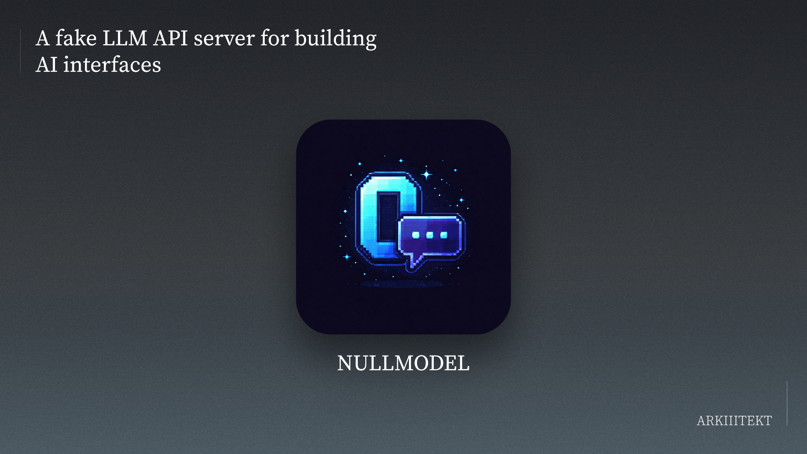

# NullModel



**Fake LLM API server for building AI interfaces — without keys, cost, or latency surprises.**

```bash
npx nullmodel
```

---

## What it is

NullModel is a drop-in replacement for OpenAI, Anthropic, and Gemini APIs. Point your app's base URL at `http://localhost:4000`, use any API key — it's all fake. Faithfully replicates the exact streaming SSE formats so your frontend can't tell the difference.

- Exact chunk/event format for OpenAI, Anthropic, and Gemini
- Built-in personas to exercise different UI states
- Chaos mode for realistic error injection
- Zero dependencies — Node.js built-ins only, works with Node 18+

| Endpoint | Provider | Streaming | Non-Streaming |
| --- | --- | --- | --- |
| `POST /v1/chat/completions` | OpenAI | ✅ SSE chunks | ✅ JSON |
| `POST /v1/messages` | Anthropic | ✅ SSE events | ✅ JSON |
| `POST /v1beta/models/:model:generateContent` | Gemini | — | ✅ JSON |
| `POST /v1beta/models/:model:streamGenerateContent` | Gemini | ✅ SSE chunks | — |

---

## Quick Start

### OpenAI SDK

```javascript
import OpenAI from 'openai';

const client = new OpenAI({
  baseURL: 'http://localhost:4000/v1',
  apiKey: 'fake-key',
});

const stream = await client.chat.completions.create({
  model: 'gpt-4',
  messages: [{ role: 'user', content: 'Hello' }],
  stream: true,
});

for await (const chunk of stream) {
  process.stdout.write(chunk.choices[0]?.delta?.content || '');
}
```

### Anthropic SDK

```javascript
import Anthropic from '@anthropic-ai/sdk';

const client = new Anthropic({
  baseURL: 'http://localhost:4000',
  apiKey: 'fake-key',
});

const stream = client.messages.stream({
  model: 'claude-sonnet-4-20250514',
  max_tokens: 1024,
  messages: [{ role: 'user', content: 'Hello' }],
});

stream.on('text', (text) => process.stdout.write(text));
```

### Direct fetch

```javascript
// OpenAI-style
const res = await fetch('http://localhost:4000/v1/chat/completions', {
  method: 'POST',
  headers: { 'Content-Type': 'application/json' },
  body: JSON.stringify({
    model: 'gpt-4',
    messages: [{ role: 'user', content: 'Hello' }],
    stream: true,
  }),
});

// Gemini-style
const res = await fetch('http://localhost:4000/v1beta/models/gemini-pro:streamGenerateContent', {
  method: 'POST',
  headers: { 'Content-Type': 'application/json' },
  body: JSON.stringify({
    contents: [{ role: 'user', parts: [{ text: 'Hello' }] }],
  }),
});

const reader = res.body.getReader();
const decoder = new TextDecoder();

while (true) {
  const { done, value } = await reader.read();
  if (done) break;
  console.log(decoder.decode(value));
}
```

---

## Personas

Built-in response shapes that exercise different UI states:

| Persona | What It Does |
| --- | --- |
| `balanced` | Medium-length, natural responses (default) |
| `verbose` | Long, detailed — tests scroll & rendering perf |
| `terse` | Very short — tests compact UI states |
| `code` | Code blocks — tests syntax highlighting |
| `markdown` | Tables, lists, emphasis — tests markdown rendering |
| `tool_calls` | Function calls — tests tool call UI |
| `error_prone` | Random error states — tests error handling |

Set a default:

```bash
npx nullmodel --persona code
```

Override per request with `"_persona"` in the request body:

```json
{
  "model": "gpt-4",
  "messages": [{ "role": "user", "content": "Hello" }],
  "stream": true,
  "_persona": "verbose"
}
```

---

## Chaos Mode

Randomly inject real-world failure scenarios:

```bash
npx nullmodel --chaos
```

When enabled, a percentage of requests will randomly:

- Return **429 rate limit** errors (with proper `retry-after` headers)
- Return **500 server errors**
- Experience **5x latency slowdowns**

Each error response matches the exact format of the real provider. Configure in `nullmodel.config.json`:

```json
{
  "chaos": {
    "enabled": true,
    "errorRate": 0.05,
    "slowdownRate": 0.1,
    "rateLimitRate": 0.02
  }
}
```

---

## Configuration

Create a `nullmodel.config.json` in your project root:

```json
{
  "port": 4000,
  "latency": {
    "firstToken": 300,
    "perToken": 30,
    "variance": 0.3
  },
  "defaults": {
    "persona": "balanced"
  },
  "chaos": {
    "enabled": false
  },
  "cors": true,
  "verbose": false
}
```

### CLI options

| Flag | Description | Default |
| --- | --- | --- |
| `--port, -p` | Server port | `4000` |
| `--persona` | Default response persona | `balanced` |
| `--latency` | Base per-token delay (ms) | `30` |
| `--chaos` | Enable chaos mode | `false` |
| `--verbose, -v` | Log all requests | `false` |
| `--personas` | List available personas | — |
| `--help` | Show help | — |

### Meta endpoints

| Endpoint | Description |
| --- | --- |
| `GET /` | Health check |
| `GET /health` | Health check |
| `GET /personas` | List available personas |
| `GET /config` | Current running config |

---

## License

MIT
